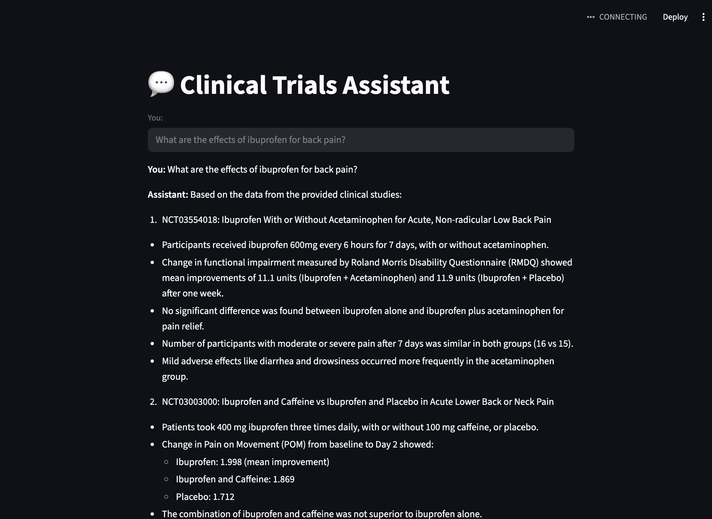

# 🧬 Clinical Trials Assistant

<div align="center">

[](https://python.org)
[](https://langchain.com)
[](https://langchain-ai.github.io/langgraph/)
[](https://streamlit.io)

*An AI-powered assistant for clinical trials research and exploration* 🔬

</div>

---

<p align="center">
    
</p>

## ✨ Features

- 🤖 **AI-Powered Conversations** - Answers questions related to clinical research based on clinicaltrials.gov data
- 🔍 **Smart Search & Retrieval** - Advanced search capabilities for clinical trial data
- 📊 **Results Reranking** - Intelligent ranking of search results for better relevance
- 🌐 **Web Interface** - Clean and intuitive Streamlit-based UI
- ⚡ **Fast & Efficient** - Built with modern Python technologies

## 🚀 Quick Start

### Prerequisites

- Python 3.13 or higher
- Poetry (for dependency management)

### Installation

1. **Clone the repository**
   ```bash
   git clone https://github.com/jwasala/clinical-trials-assistant.git
   cd clinical-trials-assistant
   ```

2. **Install dependencies**
   ```bash
   poetry install
   ```

3. **Set up environment variables**
   ```bash
   # Create a .env file with your API keys
   cp .env.example .env
   # Edit .env with your configuration
   ```

4. **Run the application**
   ```bash
   make run
   ```

The application will be available at `http://localhost:8501` 🌐

## 🛠️ Development

### Available Commands

| Command | Description |
|---------|-------------|
| `make run` | 🚀 Start the Streamlit application |
| `make test` | 🧪 Run all tests |
| `make lint` | 🔧 Lint and format code with Ruff |
| `make dry_lint` | 🔍 Check linting without making changes |

### Code Quality

This project maintains high code quality standards:

- ✅ **Linting**: Uses [Ruff](https://docs.astral.sh/ruff/) for fast Python linting
- 🎨 **Formatting**: Automatic code formatting with Ruff
- 🧪 **Testing**: Comprehensive test suite with pytest
- 📝 **Type Safety**: Type hints for better code reliability

### Running Tests

```bash
# Run all tests
make test

# Run specific test file
poetry run pytest tests/test_providers.py

# Run with coverage
poetry run pytest --cov=clinical_trials_assistant
```

## 🏗️ Architecture

```
clinical_trials_assistant/
├── 🧠 main.py           # Streamlit application entry point
├── 🔗 nodes.py          # LangGraph nodes and state management
├── 🔌 providers.py      # Data providers and integrations
```

### Core Components

- **🧠 Main Application**: Streamlit-based web interface
- **🔗 Graph Nodes**: LangGraph-powered conversation flow
- **🔌 Providers**: External data source integrations
- **🛠️ Tools**: Utility functions and helpers

## 🤝 Contributing

We welcome contributions! Please see our [Contributing Guide](CONTRIBUTING.md) for details.

### Quick Contribution Steps

1. 🍴 Fork the repository
2. 🌿 Create a feature branch (`git checkout -b feature/amazing-feature`)
3. ✅ Make your changes (ensure tests pass with `make test`)
4. 🎨 Lint your code (`make lint`)
5. 💾 Commit with conventional commits (gitmojis encouraged! 🎉)
6. 📤 Push and create a Pull Request

## 📋 Requirements

- **Python**: 3.13+
- **Dependencies**: See `pyproject.toml` for full list
- **Development**: Poetry, Ruff, pytest

## 📄 License

This project is licensed under the MIT License - see the [LICENSE](LICENSE) file for details.

## 🙏 Acknowledgments

- Built with ❤️ using [LangChain](https://langchain.com) and [Streamlit](https://streamlit.io)
- Powered by [LangGraph](https://langchain-ai.github.io/langgraph/) for conversation flow
- Code quality ensured by [Ruff](https://docs.astral.sh/ruff/)
